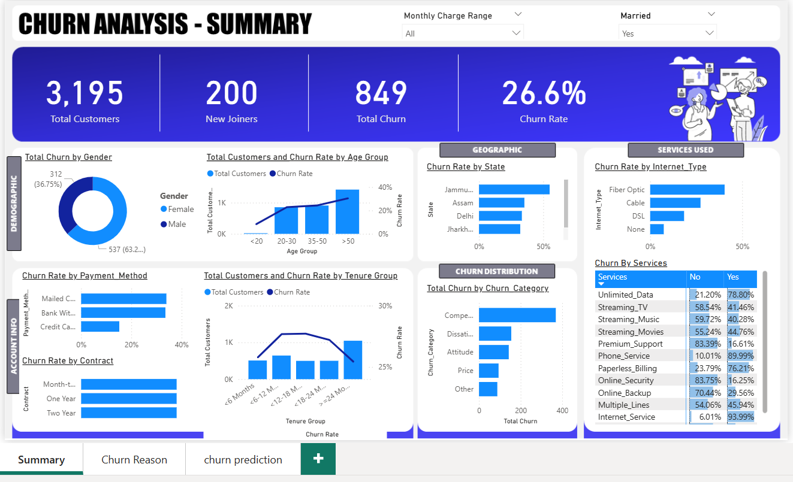
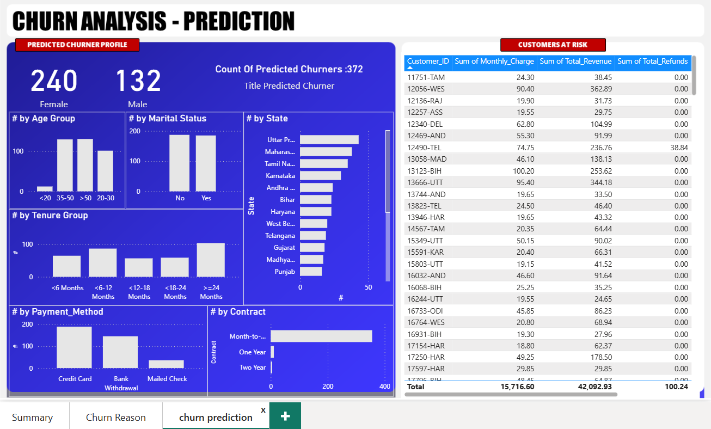

# Customer Churn Analysis and Prediction 📊🧠

This project focuses on analyzing customer churn and predicting high-risk churners using SQL for data preprocessing, a Python-based ML model, and an interactive Power BI dashboard.

---

## 🚀 Project Overview

- Built an end-to-end churn analysis system using **MySQL**, **Python**, and **Power BI**.
- Performed all data **cleaning, encoding, and feature engineering directly in SQL**.
- Designed a dynamic **Power BI dashboard** to visualize churn patterns across demographics and service usage.
- Trained a machine learning model in **Python** to predict churn likelihood based on processed SQL data.
- Integrated predictions into Power BI to generate interactive insights for business decision-making.

---

## 🛠️ Tech Stack

- **MySQL** – Data storage and preprocessing (cleaning, encoding, joins, feature creation)
- **Python** – Machine Learning using scikit-learn
- **Power BI** – Interactive dashboard and visualization
- **VS Code** – Development environment
- **MySQL Connector** – Python-MySQL integration

---

## 📸 Screenshots

### 🔹 Power BI Dashboard

### 🔹 Model Output Integration

---

## 📈 Dashboard Features

- Analyze churn rates by gender, geography, contract type, internet service, and more.
- Predict potential churners using historical data and highlight them in the dashboard.
- Slice and filter data interactively for detailed business insights.

---
